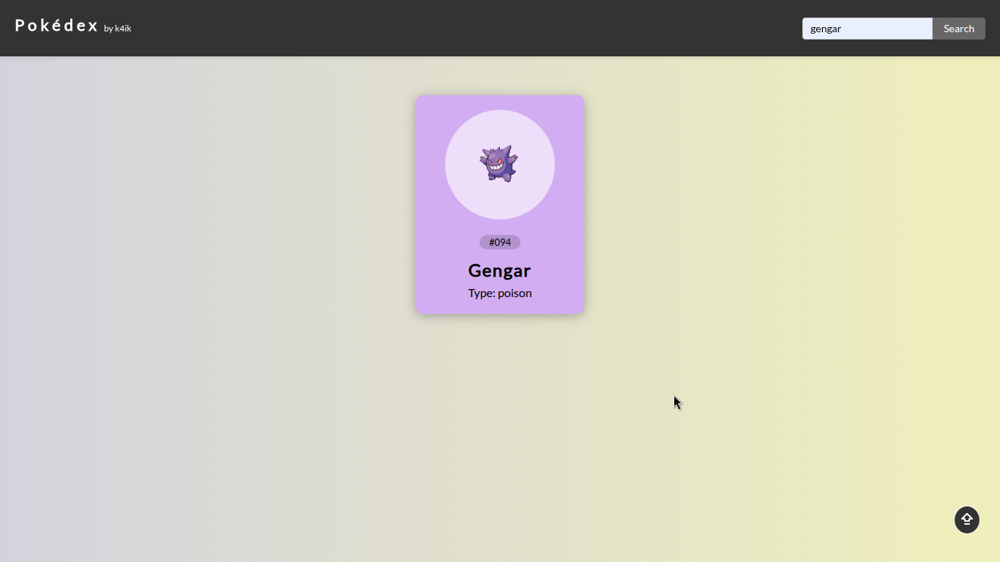
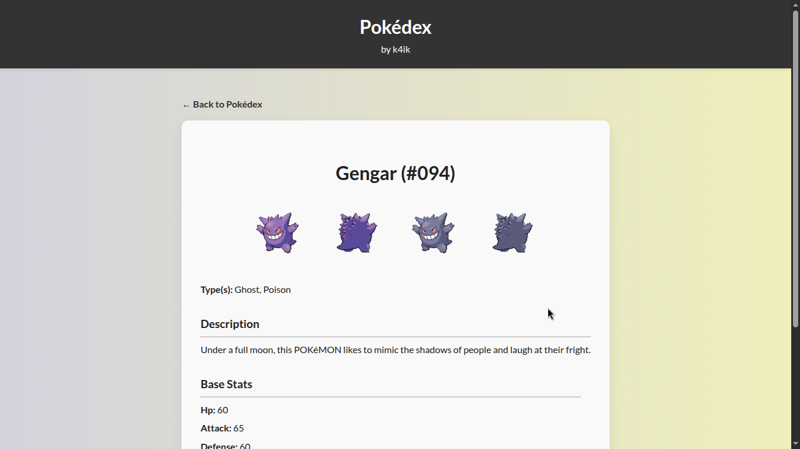

# 🟦 Pokédex — Batch, Lazy Load & Cache
> A simple and responsive Pokédex built with HTML5, CSS3, and JavaScript that demonstrates efficient data fetching with batch requests, lazy loading, and local caching.

> This project fetches Pokémon data from the PokéAPI and displays it in a clean, minimal interface. It uses performance techniques like batch requests and lazy loading to handle a large dataset smoothly, while caching data in localStorage for faster subsequent loads.

## 📸 Screenshots

## 🌍 Live Demo
[🔗 View Live Demo](https://k4ik.github.io/pokedex)

## 📚 What I Learned from This Project
> During the development of this Pokédex, I deepened my understanding of key frontend performance techniques, such as:

- Batch requests: Grouping multiple API calls together to avoid server overload and efficiently control data flow.

- Lazy loading: Loading data and UI elements progressively, fetching only what’s necessary initially and deferring the rest to optimize initial load times.

- Local caching (localStorage): Storing data in the browser to speed up future accesses, reducing the number of API calls and improving the overall app responsiveness.

> These practices are essential when working with large datasets and help deliver a faster, smoother user experience.

## 🛠️ Built With
- HTML5
- CSS3
- JavaScript